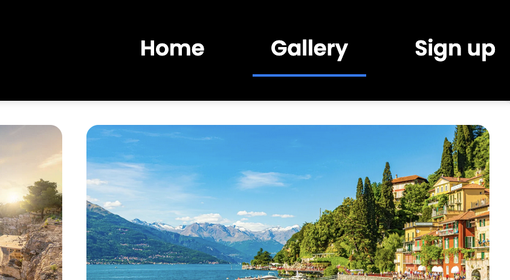
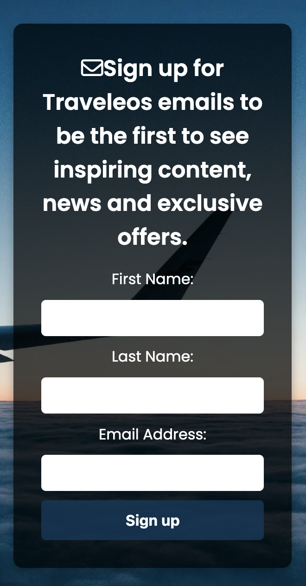
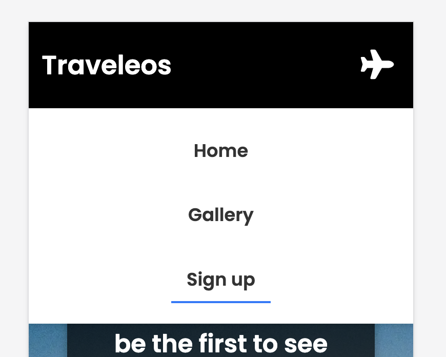

# MILESTONE-1-PROJECT

# Traveleos - Travel Adventure Website #

[Traveleos Demo](assets/images/demo-screenshot.png) 

A responsive travel website designed to inspire wanderlust, featuring destination guides, a gallery of stunning locations, and a newsletter signup form. 

## Features ##
- Responsive Design: Works seamlessly on mobile, tablet, and desktop.
- Dynamic Navigation: “Plane” menu for mobile, horizontal menu for desktop.
- Hero Section: Full-screen background image with translucent content overlay.
- Interactive Gallery: Grid layout for destinations with image captions.
- Signup Form: Stylish newsletter subscription form with hover effects.
- Social Media Integration: Linked icons for Facebook, X (Twitter), and Instagram.
- Accessibility: Semantic HTML, aria labels, and focus states.

## Technologies Used ##
- HTML5: Semantic structure and accessibility-focused markup.
- CSS3: Flexbox, Grid, transitions, and media queries for responsiveness.
- Google Fonts: *Poppins* font for modern typography.
- Font Awesome: Icons for social media and navigation toggle.
- Favicon Generator: Multi-format favicon support.

## Credits ## 
* Icons: Font Awesome
* Fonts: Google Fonts
* Inspiration: Design concepts from travel blogs and modern web templates, chat gpt, love running - code institute project, coding videos from Youtube, Google search.

##Testing ##
* Responsiveness: Tested using W3C Markup Validation Service, W3C CSS Validation Service
* Links: All internal/external links work.
* Lighthouse Report: https://pagespeed.web.dev/analysis/https-cristian-mandici-github-io-MILESTONE-1-PROJECT/wh4bwvpliz?hl=en-GB&form_factor=mobile
* Browser Compatibility: Checked on Chrome, Firefox, and Safari.

# Delpoyment

## GitHub

The project was deployed to GitHub following the next steps :
* Log in to GitHub and locate your Git Repository page;
* Select the Repository you want to deploy;
* Locate the "Settings" button on the top of the page;
* On the left side find "Code and automation" list then select "Pages";
* Under "Source", click the dropdown called "None" and select branch "Main" then select folder "root" ;
* Select "Save" wait 2 minutes and refresh the page
* Go to top corner left "<> Code" then on the right hand side find "Deployments" then see your deployed link at the top of the page.

## Wireframe Reference Guide ##

Attached Wireframes:

## DESKTOP

## TABLET

## MOBILE

# User Experience (UX) / User Stories  

## User Stories 
1. First-Time Visitor 
   - Understand the website’s purpose quickly.  
   - Navigate easily between sections.  

2. Frequent Traveler 
   - View travel inspiration and service benefits.  
   - Sign up for updates with minimal effort.  

3. Mobile User 
   - Access all features seamlessly on smaller screens.  
   - Experience fast loading times.  

# Testing  

## Testing User Stories

### 1. First-Time Visitor Goals 
- Goal: Clear understanding of the service.  
  -Met: Hero section text explaining travel offerings.  

- Goal: Easy navigation.  
  -Met: Responsive menu (mobile dropdown, desktop horizontal menu).  

### 2. Frequent Traveler Goals  
- Goal: View travel inspiration.  
  - Met: Gallery section with optimized images.  

- Goal: Simple signup process.  
  - Met: Clean form design with essential fields only.  

### 3. Mobile User Goals  
- Goal: Mobile friendly experience.  
  - Met: Mobile responsive design (see attachments).  

- Goal: Fast performance.  
  - Met: Optimized images and minimal code.  

